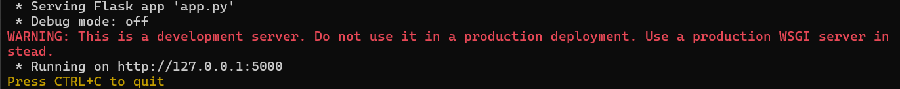
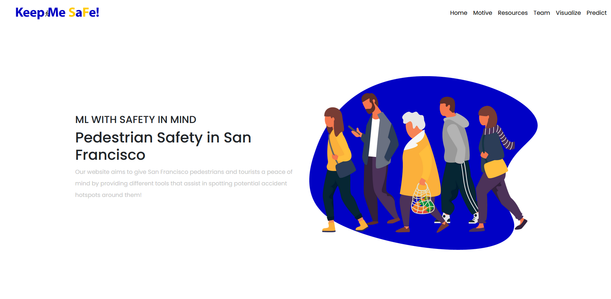
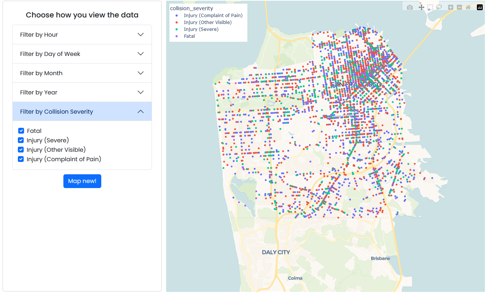
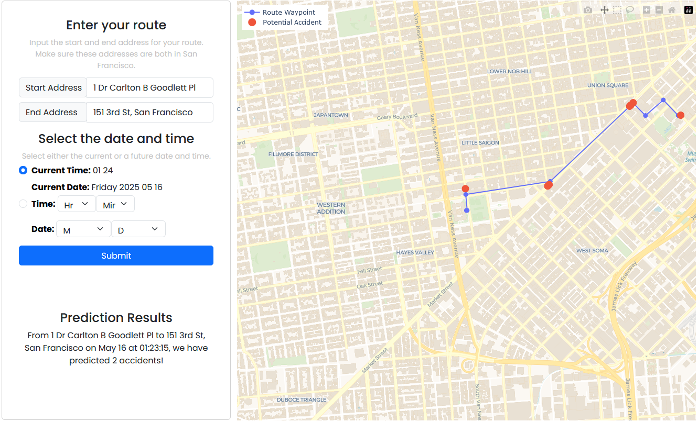

# Keep Me Safe
This repository contains the core files for my team's thesis project for UC Berkeley's Masters in Information and Data Science program from the Spring 2023 term. 

Our team decided to create a Flask web application that predicts potential accident hotspots in San Francisco for a user's given walking route which you can access here: [Keep Me SaFe](https://keep-me-safe.onrender.com/).

**IMPORTANT - If the website gives a 502 gateway error, you may need to refresh the website a couple of times to wake up the website. If the website looks broken or is missing images, keep refreshing until it matches the image below.** Otherwise, please wait for the application to load. Graphs may also take time to load even after the website is active.

If you want to run the project locally, you must create a `.env` file with the variable `API_KEY` set to your Google Maps API key. The file should live on the same directory as the `app.py` file. You must also install all python packages listed in the `requirements.txt` to make sure the application works as intended.

After creating the `.env` file and installing the packages, you can simply run the following command in your terminal:

```
flask --app app.py run
``` 
A link to the website should appear in your terminal.



Clicking the http://127.0.0.1:5000 wiil take you to the website being locally hosted in your preferred web browser.



## Tools used

- **Machine Learning and Visualizations**: Python (Plotly, Numpy, Pandas, XGBoost), Google Maps APIs
- **Web Development**: Python (Flask), Bootstrap
- **Deployment**: Render (Cloud Application Platform)
- **Code Management**: Visual Code, Git and Github

## Motivation
In 2020, more than 6,700 pedestrians were killed while walking and using wheelchairs, despite a dramatic decrease in the number of cars on the road and the number of miles traveled. Because our team was split between those who relied on public transport versus those who relied on our own cars, we thought this was an intriguing topic to delve into in order to understand why this phenomenon was happening, especially since traffic collisions and deaths are preventable and often occur as a result of the way transportation in the United States has been designed – for the fast, uninterrupted movement of vehicles.

**Looking through tools that seeked to remedy this, we saw they weren't as approachable for users to learn more nor user-friendly to use on their phones if they were out already.** Because of this, we wanted to see if there was a way to bring more awareness to pedestrians before they started their routes without making it an intimidating tool to use.

## Project Proposal

When first creating out project proposal, we wanted our product to cover any state in the US. We quickly found that only certain locations (namely cities with a high-density population like Los Angeles and Chicago) had the type of data we were looking for. Even when we found data sources in different cities, they were all organized differently. In order to have a ready product by the end of our semester, we decided to scope it down to San Francisco since the city provides datasets for incidents like car accidents that are readily available for use. 

From looking through the dataset provided by DataSF, we could hone our product vision into this: **a user-friendly mapping tool that provides precise coordinates of potential accident hotspots on a user's inputted walking route**. Additionally, we would add a data visualization for users in case they wanted to explore the dataset we were using to base our ML algorithm.

## Project Features
To highlight our project proposal, we sought to create a tool that would:

1. Output and graph coordinates of potential accident hotspots
2. Make the tool approachable for any user who wanted to learn more the car-pedestrian accidents in San Francisco
3. Make the tool usable for a more realistic situation (i.e. a user is out and only has their phone on hand)

With these three goals in mind, we decided a web application that could host a Machine Learning algorithm but also map routes and visualize data in a single package would be best.

From there our website splits into three parts, a "Learning" page, a "Visualize" page, and a "Predict" page.

- The "Learning" page describes our motivation for the project, the resources we used to create the project, and the wonderful people who created the project.
- The "Visualize" page visualizes the entirety of the cleaned data we used to train our model with. Users can see all the plots color-coded by collision severity and filter our data plotted based on the "Hour", "Day of Week", "Month", "Year" and "Collision Severity" of the data points. 
 
- The "Predict" page plots the route a user inputs into the page and gives the number of accidents that are directly on the route. Accidents near the route will also be plotted for the user's awareness.
 

## Resources Used

To better understand the phenomenom, we used many resources from experts who have done extensive research on the subject. Without these resources, we would not have been able to understand our data points as well as we had.

- [Predicting Pedestrian Fatality](https://www.mdpi.com/2071-1050/14/4/2436)
- [US Crash Hotspots and Traits](https://www.jtlu.org/index.php/jtlu/article/view/1825)
- [Community Design vs Traffic Safety](https://www.tandfonline.com/doi/full/10.1080/01944360902950349)

To train our Machine Learnign algorithm, we decided to use these publicly available DataSF datasets: 
- [Traffic Crashes Resulting in Injury](https://data.sfgov.org/Public-Safety/Traffic-Crashes-Resulting-in-Injury/ubvf-ztfx/about_data)
- [Traffic Crashes Resulting in Fatality](https://data.sfgov.org/Public-Safety/Traffic-Crashes-Resulting-in-Fatality/dau3-4s8f/about_data)

These are other articles we used to better understand the subject:
- [UC Berkeley SafeTREC Resources](https://tims.berkeley.edu/)
- [Pedestrian Injuries in SF](https://www.sfdph.org/dph/hc/HCCommPublHlth/Agendas/2011/february%2015/feb%2015%20pedstrian%20safety%20presentation.pdf)
- [The deadliest road in America](https://www.vox.com/23178764/florida-us19-deadliest-pedestrian-fatality-crisis)


## Contributors
This project would not have been possible without my wonderful team members:
- Amanda Ly* who was one of the Machine Learning Engineers on the team and was our primary Subject Matter Expert
- [Anstonia Ma](https://www.linkedin.com/in/anstoniama/) who led the Model Building and Evaluation and contributed as a Machine Learning Engineer
- Tajesvi Bhat* who led the Data Engineering effort and contributed as a Machine Learning Engineer

\* - no LinkedIn profile
